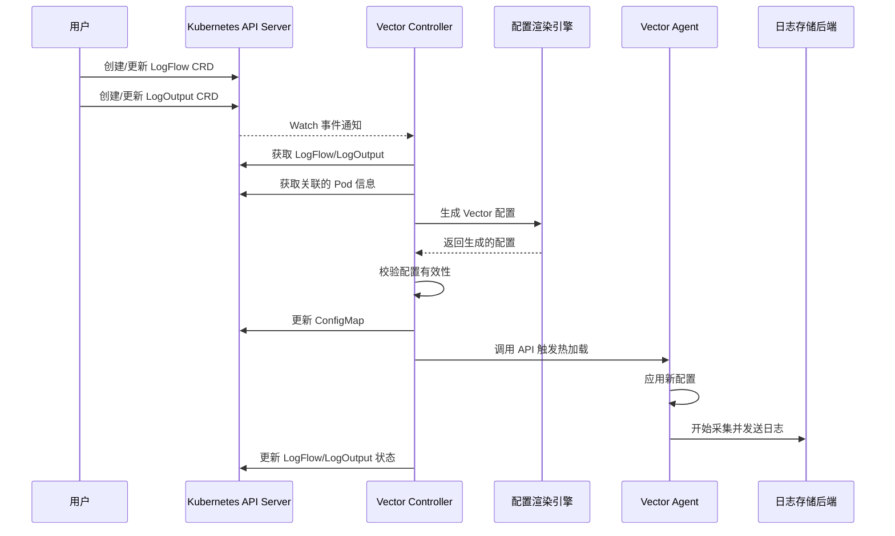

# Vector-Controller 架构设计文档

## 1. 系统概述

Vector-Controller 是一个基于 Kubernetes 的原生日志采集系统，通过自定义资源定义（CRD）进行声明式管理，实现日志的自动发现、处理和分发。本文档详细描述了系统的架构设计和各组件之间的交互。

## 2. 核心架构

### 2.1 架构图

```
┌─────────────────────────┐
│      用户配置层         │
│  LogFlow/LogOutput CRD  │
└───────────┬─────────────┘
            ↓
┌─────────────────────────┐
│      控制平面          │
│    Vector Controller    │
└───────────┬─────────────┘
            ↓
┌─────────────────────────┐
│      数据平面          │
│     Vector Agent        │
└───────────┬─────────────┘
            ↓
┌─────────────────────────┐
│    日志存储后端         │
│ Kafka/ES/Loki/S3等      │
└─────────────────────────┘
```

### 2.2 组件说明

#### 2.2.1 控制平面组件

| 组件名称 | 说明 |
|---------|------|
| **Vector Controller** | 控制器核心组件，部署为Deployment，监听CRD变更并生成Vector配置 |
| **LogFlow CRD** | 定义日志采集规则，包括数据源和元数据注入配置 |
| **LogOutput CRD** | 定义日志存储目标，配置输出后端 |

#### 2.2.2 数据平面组件

| 组件名称 | 说明 |
|---------|------|
| **Vector Agent** | 日志采集Agent，部署为DaemonSet，运行在每个节点上 |
| **ConfigMap** | 存储Vector全局基础配置，包含基础运行参数和通用配置项 |

#### 2.2.3 日志后端

| 组件名称 | 说明 |
|---------|------|
| **Kafka** | 消息队列，用于日志的高吞吐传输 |
| **Elasticsearch** | 搜索引擎，用于日志的存储和搜索 |
| **Loki** | 轻量级日志聚合系统 |
| **S3** | 对象存储，用于日志长期归档 |

## 3. 组件交互流程

### 3.1 配置生成与下发流程



### 3.2 日志采集流程

```
1. Vector Agent 根据配置监控日志源（文件、标准输出等）
2. 日志事件被采集到 Vector 内部 Pipeline
3. 根据配置应用变换器处理日志内容（注入元数据、解析、过滤等）
4. 处理后的日志被发送到指定的后端存储
```

## 4. 关键设计决策

### 4.1 CRD 设计决策

Vector-Controller 采用两个独立的 CRD 来分离关注点：

- **LogFlow**：关注日志采集的"来源"，包括数据源配置和元数据注入
- **LogOutput**：关注日志的"去向"，定义存储后端和输出格式

这种设计允许在集群级别（通过 ClusterRole）共享输出配置，同时允许各命名空间独立配置采集规则。

### 4.2 控制器设计决策

Vector Controller 采用 Rancher Wrangler 框架实现，该框架提供了简洁高效的 Kubernetes 控制器开发体验。控制器的核心功能包括：

1. **事件处理**：使用 Wrangler 的 OnChange/OnRemove 机制处理 CRD 和 Pod 的变更
2. **缓存机制**：利用 Wrangler 的缓存减少 API 服务器负载
3. **配置渲染**：将 CRD 转换为 Vector 配置
4. **配置校验**：在应用前验证配置有效性
5. **热加载实现**：通过 Vector API 触发配置热加载

### 4.3 Vector Agent 部署决策

Vector Agent 部署为 DaemonSet，确保每个节点上都有一个实例负责采集该节点上所有 Pod 的日志。主要考虑因素：

1. **资源隔离**：Agent 容器有独立的资源限制
2. **权限控制**：使用 securityContext 和最小权限原则
3. **卷挂载**：挂载节点日志目录和 Kubernetes 元数据

### 4.4 元数据注入策略

Vector-Controller 采用了两种元数据注入策略：

1. **Vector 原生注入**：利用 Vector 的 `kubernetes_logs` 源自动注入 Pod 元数据
2. **自定义注入**：通过 Transform 组件，由控制器生成自定义的元数据注入代码

## 5. 数据流与处理管道

### 5.1 Vector 处理管道

```
源(Source) → 变换(Transform) → 接收器(Sink)
```

1. **源(Source)**：定义数据的来源，如文件、标准输出、系统指标等
2. **变换(Transform)**：处理和转换数据，如解析、过滤、聚合等
3. **接收器(Sink)**：定义数据的目的地，如 Kafka、Elasticsearch 等

### 5.2 Vector 配置示例

以下是 Vector Controller 生成的配置示例：

```toml
data_dir = "/var/lib/vector"

# 源配置
[sources.log_nginx]
type = "file"
include = ["/var/log/nginx/*.log"]
read_from = "beginning"

[sources.k8s_logs]
type = "kubernetes_logs"
extra_label_selector = "app=nginx"

# 元数据注入
[transforms.add_static_fields]
type = "remap"
inputs = ["log_nginx"]
source = '''
  .kubernetes = {
    "pod_namespace": "production",
    "pod_name": "nginx-abc123",
    "pod_labels": {
      "app": "nginx",
      "env": "prod"
    }
  }
'''

# 接收器配置
[sinks.kafka_sink]
type = "kafka"
inputs = ["add_static_fields", "k8s_logs"]
bootstrap_servers = "kafka-1:9092,kafka-2:9092"
topic = "app-logs"
encoding.codec = "json"

[sinks.es_sink]
type = "elasticsearch"
inputs = ["add_static_fields", "k8s_logs"]
endpoint = "https://elasticsearch:9200"
index = "logs-%Y-%m-%d"
```

## 6. 扩展性设计

### 6.1 支持多种日志源

Vector-Controller 设计为支持多种类型的日志源，包括：

- 容器标准输出/错误（`kubernetes_logs`）
- 文件日志（`file`）
- 系统指标（`host_metrics`）
- 内部指标（`internal_metrics`）

通过 CRD 中的灵活配置，可以轻松扩展支持新的日志源类型。

### 6.2 支持多种输出后端

系统支持多种日志存储后端，每种后端都有其特定的配置选项：

- **Kafka**：用于高吞吐量的实时日志传输
- **Elasticsearch**：用于全文搜索和复杂查询
- **Loki**：用于按标签索引的轻量级日志存储
- **S3/对象存储**：用于日志的长期归档存储

### 6.3 自定义处理逻辑

Vector-Controller 允许通过 CRD 配置自定义的日志处理逻辑，包括：

- **字段提取**：从非结构化日志中提取字段
- **字段转换**：数据类型转换、格式化等
- **过滤逻辑**：根据条件过滤日志
- **聚合计算**：对日志进行分组和聚合计算

## 7. 可靠性与容错机制

### 7.1 配置校验机制

Vector Controller 在应用配置前执行严格的校验：

1. **CRD 验证**：通过 OpenAPI v3 模式验证 CRD 字段
2. **Vector 配置验证**：使用 `vector validate` 命令验证生成的配置
3. **测试应用**：在应用到所有 Agent 前在测试环境验证

### 7.2 回滚机制

当配置更新失败时，系统会自动回滚到上一个有效配置：

1. 保存当前有效配置的备份
2. 尝试应用新配置
3. 如果应用失败，自动恢复备份配置

### 7.3 状态监控

Vector Controller 维护 CRD 资源的状态字段，记录配置生成和应用的状态：

```yaml
status:
  configGenerated: true
  lastConfigUpdate: "2023-07-01T10:30:00Z"
  conditions:
    - type: Ready
      status: "True"
      reason: ConfigApplied
      message: "Config successfully applied to all agents"
      lastTransitionTime: "2023-07-01T10:30:05Z"
```

## 8. 性能考虑

### 8.1 资源优化

Vector Agent 的资源配置基于以下考虑：

- **CPU 限制**：根据预期日志量和处理逻辑复杂度设置
- **内存限制**：根据缓冲区大小和并发处理能力设置
- **磁盘使用**：用于持久化缓冲区，防止数据丢失

### 8.2 批处理与缓冲

为了优化性能和减少资源消耗，Vector 配置中包含批处理和缓冲策略：

```toml
[sinks.kafka_sink]
# ... 其他配置 ...
batch.max_events = 1000
batch.timeout_secs = 1

buffer.type = "disk"
buffer.max_size = 104900000 # 100MB
```

### 8.3 水平扩展

系统设计支持水平扩展：

- **Vector Controller**：利用 Wrangler 框架的高并发处理能力，可通过设置线程数扩展
- **Vector Agent**：作为 DaemonSet 自动在新节点上部署
- **后端存储**：支持连接到分布式后端系统（如 Kafka 集群）

## 9. 安全考虑

### 9.1 权限控制

基于最小权限原则，系统使用以下 Kubernetes 安全机制：

- **ServiceAccount**：为 Controller 和 Agent 分配专用账号
- **RBAC**：定义精确的权限范围
- **SecurityContext**：限制容器特权

### 9.2 敏感数据处理

对于日志中的敏感信息，系统提供以下处理机制：

- **字段屏蔽**：通过 Transform 配置屏蔽敏感字段
- **数据加密**：支持到后端的加密传输（如 TLS）
- **访问控制**：基于 Kubernetes 命名空间隔离日志访问权限

## 10. 部署与运维

### 10.1 部署模式

Vector-Controller 支持以下部署模式：

- **标准模式**：Controller 作为 Deployment，Agent 作为 DaemonSet
- **高可用模式**：Controller 多副本，配置存储在持久卷
- **集群联邦模式**：支持跨集群日志采集

### 10.2 升级策略

系统支持以下升级方式：

- **Controller 升级**：使用 Kubernetes 滚动更新
- **Agent 升级**：使用 DaemonSet 的更新策略，支持分批更新
- **配置升级**：通过更新 CRD 自动触发配置更新

### 10.3 监控与告警

系统集成了完整的监控和告警机制：

- **健康检查**：Controller 和 Agent 提供 /health 端点
- **指标暴露**：通过 Prometheus 格式暴露运行指标
- **日志记录**：详细记录系统事件和异常

## 11. 技术选择

### 11.1 Wrangler框架优势

Vector-Controller 采用 Rancher Wrangler 框架的主要优势：

1. **简洁的API设计**：更直观的控制器开发体验
2. **高效的缓存机制**：减少API服务器负载
3. **类型安全的代码生成**：提供类型安全的客户端
4. **事件处理模型**：基于OnChange/OnRemove的简洁事件处理
5. **低资源占用**：相比其他框架，更轻量级和高效

### 11.2 Wrangler vs 其他框架

| 方面 | Wrangler | Kubebuilder | Operator SDK |
|------|----------|-------------|--------------|
| **代码生成** | 生成类型安全的客户端 | 主要生成CRD和webhook | 基于Kubebuilder，还支持Ansible/Helm |
| **控制器注册** | 基于Handler函数 | 基于Reconciler接口 | 基于Reconciler接口 |
| **学习曲线** | 较平缓 | 较陡峭 | 较陡峭 |
| **资源消耗** | 轻量级 | 中等 | 较重 |
| **社区支持** | Rancher社区 | Kubernetes SIG | RedHat/社区 |
| **适用场景** | 轻量到中等复杂度控制器 | 复杂控制器和Webhook | 复杂运维自动化 |

## 12. 后续规划

1. **插件扩展**：支持自定义插件开发，扩展数据处理能力
2. **UI 管理界面**：开发可视化配置和管理界面
3. **多集群管理**：增强跨集群采集和管理能力
4. **高级流处理**：支持更复杂的流处理和分析能力
5. **自定义告警**：基于日志内容生成自定义告警 