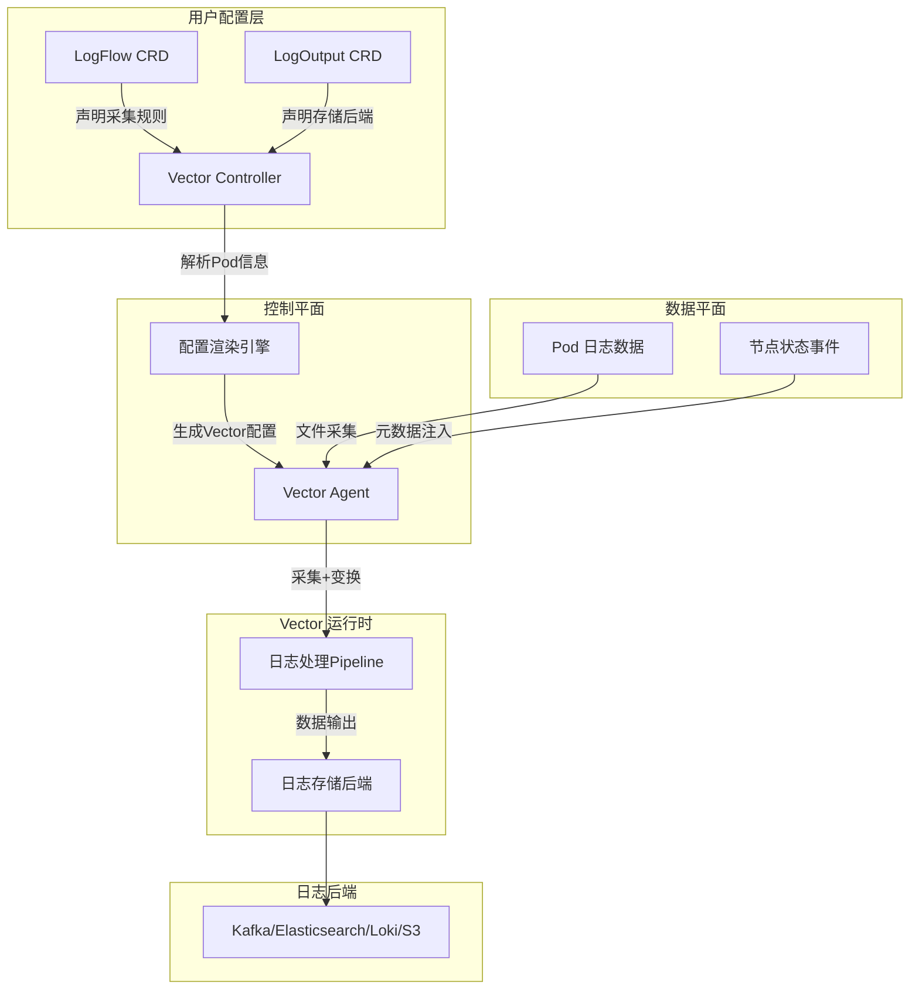
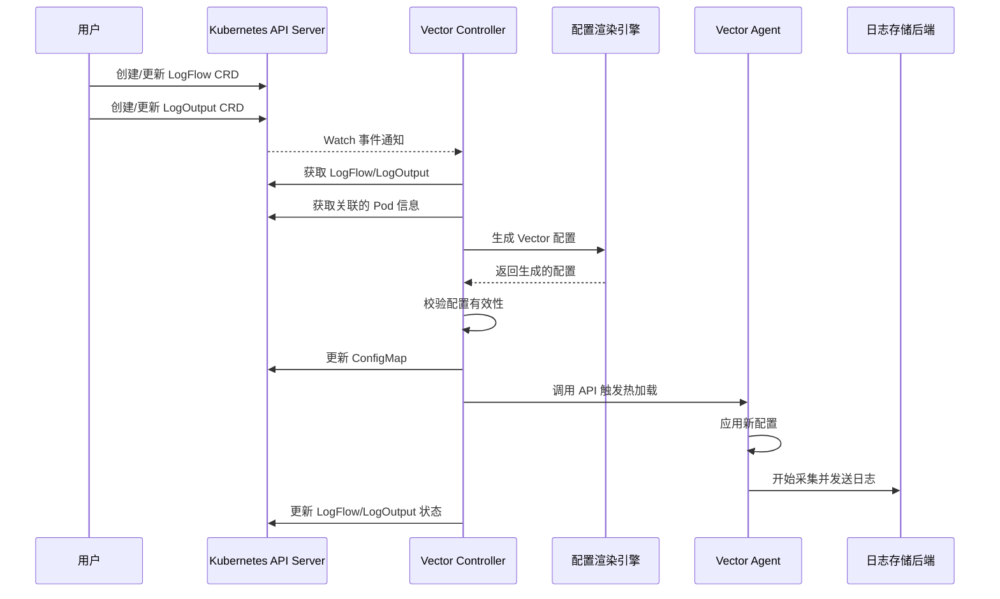
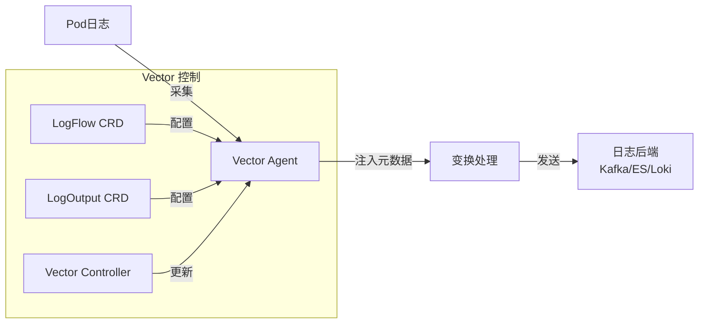

## **一、方案概述**

### **目标**

本方案旨在构建 Kubernetes 原生的日志采集系统，基于 `Vector` 作为日志采集 Agent，实现以下核心能力：

1. **全自动发现**：动态感知 `Pod` 生命周期和存储配置，自动调整采集规则。
2. **CRD 驱动管理**：通过 `CRD` 进行声明式管理，实现 `日志采集 + 变换 + 分发` 的一体化配置。
3. **元数据自动注入**：采集 `Pod` 级别的日志时，自动补充 `Kubernetes` 相关的元数据（`Namespace`、`PodName`、`Labels` 等）。
4. **多后端支持**：支持 `Kafka`、`Elasticsearch`、`Loki`、`S3` 等多种日志存储后端。
5. **高可靠性**：配置校验、热加载、动态变更、异常处理，确保日志采集稳定运行。

------

## **二、架构设计**

### **整体架构**



### **关键组件**

| 组件名称              | 作用                                             |
| --------------------- | ------------------------------------------------ |
| **LogFlow CRD**       | 定义日志采集规则（Source + Transform + Output）  |
| **LogOutput CRD**     | 定义日志存储目标（Kafka、Elasticsearch 等）      |
| **Vector Controller** | 监听 CRD 变更，解析 `Pod` 信息，生成 Vector 配置 |
| **Vector Agent**      | 运行在 `DaemonSet` 模式，采集并转发日志          |
| **日志后端**          | Kafka、Elasticsearch、S3、Loki 等                |

------

## **三、核心 CRD 设计**

### **1. LogFlow CRD**

定义日志采集规则，包括 `Source`（采集方式）、`Transform`（日志处理）和 `OutputRef`（日志存储）。

```yaml
apiVersion: logging.vector.io/v1
kind: LogFlow
metadata:
  name: app-log-flow
  namespace: production
spec:
  # 1. 日志源配置：定义日志采集的源和路径
  sources:
    # Kubernetes 日志采集源，支持标签选择器等
    kubernetes_logs:
      type: kubernetes_logs
      extra_namespace_label_selector: "app=log"
    # 文件日志源，支持路径和匹配规则
    logfile:
      type: file
      read_from: beginning
      include:
        - "/var/log/app/**/*.log"
    # 主机指标源
    host_metrics:
      type: host_metrics
      filesystem:
        devices:
          excludes: ["binfmt_misc"]
        filesystems:
          excludes: ["binfmt_misc"]
        mountpoints:
          excludes: ["*/proc/sys/fs/binfmt_misc"]
    # 内部指标源
    internal_metrics:
      type: internal_metrics

  # 2. 元数据注入配置：定义需要注入的 Kubernetes 元数据字段（由控制器自动提取）
  metadata:
    inject:
      - podName
      - namespace
      - podLabels
      - deployment  # Kubernetes Deployment 名称
      - nodeName    # Kubernetes 节点名称（如有需要）

# 3. 输出配置：引用外部的 LogOutput CRD
  outputRef:
    name: kafka-output
    namespace: logging-system

```

------

### **2. LogOutput CRD**

定义日志存储后端信息，如 `Kafka`、`Elasticsearch`。

```yaml
apiVersion: logging.vector.io/v1
kind: LogOutput
metadata:
  name: kafka-output
  namespace: logging-system
spec:
  # 输出配置：定义输出目标和数据流向
  sinks:
    # Prometheus 输出，收集主机和内部指标
    prom_exporter:
      type: prometheus_exporter
      inputs: ["host_metrics", "internal_metrics"]
      address: "0.0.0.0:9090"

    # 标准输出，输出到控制台
    stdout:
      type: console
      inputs: ["kubernetes_logs", "extract_k8s_metadata"]
      encoding:
        codec: json

    # Kafka 输出，将日志发送到 Kafka
    kafka_output:
      type: kafka
      inputs: ["kubernetes_logs", "extract_k8s_metadata"]
      bootstrap_servers: "kafka-test.default.svc.cluster.local:9092"
      topic: "k8s-logs-{{ kubernetes.pod_namespace }}"
      encoding:
        codec: json
      compression: "gzip"
      key_field: ".kubernetes.pod_name"
```

------

## **四、控制器实现**

`Vector Controller` 基于 **Rancher Wrangler 框架**实现，监听 `LogFlow` 和 `Pod` 事件，自动生成 `Vector` 配置，主要功能包括：

1. **自动发现日志路径**
   - 解析 `Pod` 的 `Volume` 挂载信息，动态生成 `日志路径`。
   - 适配 `标准输出`、`HostPath`、`PVC` 等存储方式。
   
2. **自动注入 Kubernetes 元数据**
   - 获取 `Pod` 信息，并填充 `静态字段`（`podName`、`namespace`、`labels` 等）。
   - 确保 `Vector` 采集的日志 **匹配目标 Pod，而非 Vector 自身的 Pod**。
   
3. **Vector 配置生成与热加载**
   - **配置校验**：调用 `vector validate` 命令，确保配置正确后才更新。
   - **实时热加载**：通过 `Vector API` 触发动态更新，而不是 `--watch-config` 轮询机制。

### **4.1 控制器基础架构**

Vector Controller 使用 Wrangler 框架的 OnChange 和 OnRemove 事件机制实现控制器：

```go
// 控制器实现示例
type Controller struct {
    // 客户端依赖
    loggingClient   logging.Interface
    coreClient      corev1.Interface
    
    // 缓存和状态
    loggingCache    logging.LogFlowCache
    podCache        corev1.PodCache
    
    // 其他依赖
    vectorConfigGen *vector.ConfigGenerator
}

// 初始化控制器
func Register(ctx context.Context, clients *wrangler.Context) error {
    controller := &Controller{
        loggingClient:   clients.Logging,
        coreClient:      clients.Core,
        loggingCache:    clients.Logging.Cache(),
        podCache:        clients.Core.Cache(),
        vectorConfigGen: vector.NewConfigGenerator(),
    }
    
    // 注册事件处理程序
    clients.Logging.LogFlow().OnChange(ctx, "logflow-controller", controller.OnLogFlowChange)
    clients.Logging.LogFlow().OnRemove(ctx, "logflow-controller", controller.OnLogFlowRemove)
    
    return nil
}
```

### **4.2 Wrangler 框架优势**

使用 Rancher Wrangler 框架的主要优势：

1. **简洁的API设计**：比传统 Kubernetes 控制器框架更直观
2. **高效的缓存机制**：减少 API 服务器负载
3. **类型安全的代码生成**：提供类型安全的客户端
4. **简洁的事件处理模型**：基于 OnChange/OnRemove 的事件处理
5. **低资源占用**：轻量级控制器运行时

------

## **五、Vector 采集配置示例**

`Vector Controller` 生成的 `Vector` 配置如下：

```yaml
data_dir = "/var/lib/vector"

[sources.log_nginx]
type = "file"
include = ["/var/log/nginx/*.log"]
read_from = "beginning"

[transforms.add_static_fields]
type = "remap"
inputs = ["log_nginx"]
source = '''
  .kubernetes = {
    "pod_namespace": "production",
    "pod_name": "nginx-abc123",
    "pod_labels": {
      "app": "nginx",
      "env": "prod"
    }
  }
'''

[sinks.kafka_sink]
type = "kafka"
inputs = ["add_static_fields"]
bootstrap_servers = "kafka-1:9092,kafka-2:9092"
topic = "app-logs"
encoding.codec = "json"
```

------

## **六、核心优化点**

### ✅ **1. 自动填充目标 Pod 元数据**

- 避免 `Vector` 采集自身 `Pod` 信息，确保注入的是**被采集 Pod 的信息**。
- 通过 `remap` 变换器插入 `kubernetes.pod_name`、`kubernetes.namespace` 等字段。

### ✅ **2. 配置校验与热加载**

- **校验配置**：在 `Vector Controller` 变更 `ConfigMap` 之前，执行 `vector validate` 以确保配置正确。
- **实时更新**：使用 `Vector API` 触发 `reload`，避免 `--watch-config` 方式的延迟。

### ✅ **3. 支持多种日志存储后端**

- `Kafka`、`Elasticsearch`、`Loki`、`S3` 等多种后端可配置。
- `LogOutput` 允许在 `Cluster` 级别或 `Namespace` 级别共享。

### ✅ **4. 轻量级实现**

- 基于 Rancher Wrangler 框架实现轻量级控制器
- 充分利用缓存机制减少 API 服务器负载
- 简洁的事件处理模型提高响应效率

------

## **七、核心工作流程**

### **1. 配置下发流程**

```
用户创建 LogFlow/LogOutput
→ Vector Controller 监听 CRD 变化
→ 解析关联的 Pod 信息
→ 生成 Vector 配置
→ 执行 vector validate 进行校验
→ 触发 Vector API 进行热加载
```



### **2. 日志处理流程**



------

## **八、部署与管理**

### **1. 部署 Vector-Controller**

```bash
# 应用 CRD 定义
kubectl apply -f manifests/crds/

# 部署 Vector Controller
kubectl apply -f manifests/deployment/controller.yaml

# 部署 Vector Agent DaemonSet
kubectl apply -f manifests/deployment/agent.yaml
```

### **2. 创建 LogFlow 和 LogOutput**

```bash
# 创建日志输出配置
kubectl apply -f examples/logoutput-kafka.yaml

# 创建日志采集配置
kubectl apply -f examples/logflow-nginx.yaml
```

### **3. 验证配置生效**

```bash
# 查看 Vector 配置是否更新
kubectl get configmaps -n vector-system vector-config -o yaml

# 验证 Vector 进程是否接收到配置
kubectl exec -n vector-system vector-agent-xxxxx -- curl -s http://localhost:8686/health

# 检查日志流是否正常
kubectl logs -n vector-system -l app=vector-agent
```

------

## **九、技术栈**

1. **控制器实现**：Rancher Wrangler 框架
2. **日志采集引擎**：Vector
3. **配置生成**：Go 模板引擎
4. **配置校验**：Vector CLI（validate 命令）
5. **存储后端支持**：Kafka、Elasticsearch、Loki、S3 等